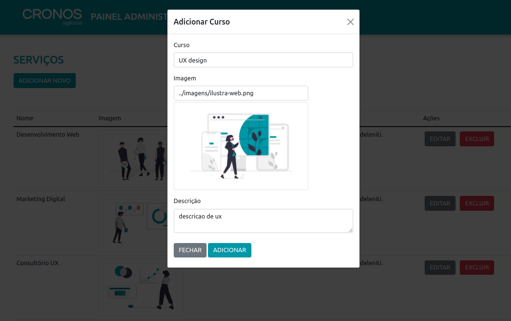

## 📝 Descrição

<p align="center">Projeto desenvolvido durante o curso de Desenvolvimento Full Stack da Gama Academy. A proposta desse projeto era implementar as funções de CRUD (Create, Read, Update e Delete) nos cursos de uma agência de marketing digital.</p>



## 🛠 Tecnologias

As seguintes ferramentas foram usadas na construção do projeto:

- JavaScript 
- React
- HTML5
- CSS3
- Bootstrap

## 🖥️ Como Executar


```
# Clonar o repositório
$ git clone https://github.com/alesalg/Desafio-Trio-Gama.git

# Acesse a pasta do projeto pelo terminal
$ cd Desafio-Trio-Gama/render

# Instale as dependências
$ npm install

# Execute a aplicação
$ npm start

# O servidor inciará automaticamente na porta:3000, ou acesse <http://localhost:3000>
```

## Desenvolvedores


<table>
  <tr>
    <td align="center"><a href="https://github.com/alesalg"><br /><sub><b>Alexandre Salgueiro Barbosa</b></sub></a><br/></a></td>
    <td align="center"><a href="https://github.com/palomapfalchi"><br /><sub><b>Paloma Patrícia Falchi</b></sub></a><br /></a></td>

  </tr>
</table>
